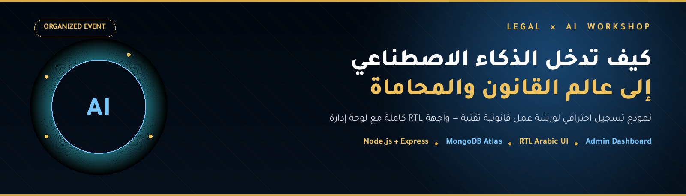
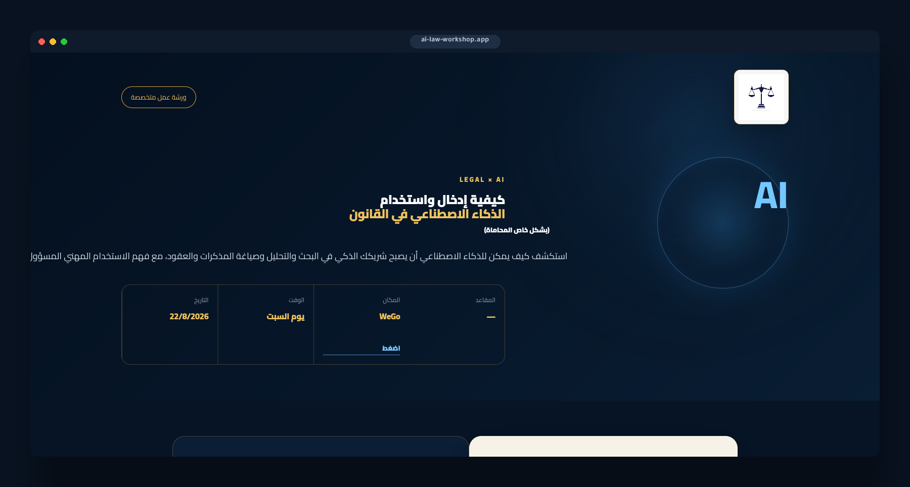
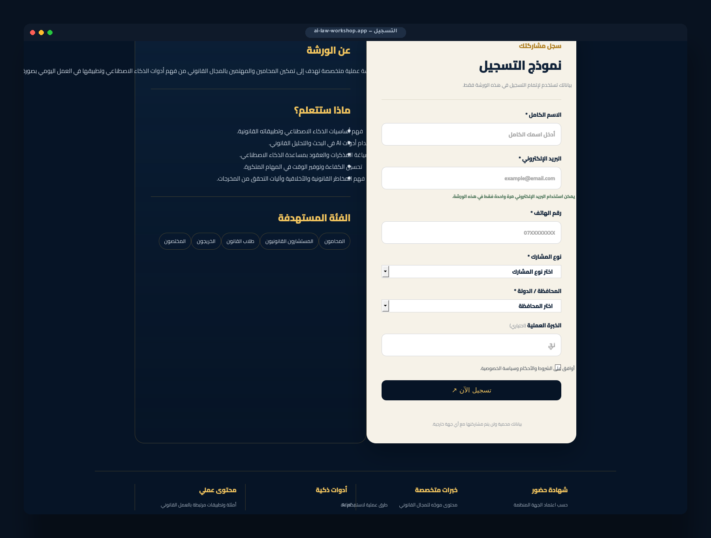

<div align="center">



<br/>

[](https://nodejs.org)
[](https://expressjs.com)
[](https://www.mongodb.com/atlas)
[](https://render.com)
[]()

<p><em>واجهة تسجيل احترافية بالكامل باللغة العربية (RTL)، مبنية لورشة عمل متخصصة بعنوان</em><br/><strong>«كيفية إدخال واستخدام الذكاء الاصطناعي في القانون — بشكل خاص المحاماة»</strong></p>

</div>

<br/>


## 📖 نظرة عامة

هذا المشروع عبارة عن **تطبيق ويب متكامل من صفحة واحدة (Full-stack)** مخصص لتسجيل المشاركين في ورشة عمل قانونية-تقنية. تم تصميمه بهوية بصرية فاخرة (كحلي داكن × ذهبي) تعكس طابع المجال القانوني، مع تجربة استخدام سلسة بالكامل باللغة العربية واتجاه RTL، بالإضافة إلى **لوحة إدارة (Admin Dashboard)** كاملة لمتابعة التسجيلات وإدارتها دون الحاجة للدخول المباشر لقاعدة البيانات.

الخادم (Node.js / Express) يخدم كلًا من الواجهة الأمامية والـ API من نفس المشروع — بدون الحاجة لاستضافة منفصلة.

<br/>

## 🖼️ لقطات من الواجهة

<div align="center">

<br/><sub>الصفحة الرئيسية — Hero Section بتصميم كحلي/ذهبي مع بيانات الورشة الحيّة (المقاعد، التاريخ، الموقع)</sub>
<br/><br/>

<br/><sub>قسم «عن الورشة» + نموذج التسجيل بخلفية كريمية (Cream) للتباين مع الهيدر الكحلي</sub>
</div>

<br/>

## ✨ أبرز المزايا

<table>
<tr>
<td width="50%" valign="top">

### 🎨 الواجهة الأمامية
- تصميم RTL كامل ومخصص من الصفر (بدون قوالب جاهزة)
- هوية بصرية متسقة: كحلي `#061426` × ذهبي `#D8A63A` × كريمي `#F6F2E8`
- خطوط عربية احترافية: **Cairo** و **IBM Plex Sans Arabic**
- تصميم متجاوب بالكامل (Responsive) لجميع المقاسات
- عرض حي لعدد المقاعد المتبقية من قاعدة البيانات
- بانر تلقائي عند إغلاق التسجيل
- تحقق فوري من صحة الحقول (Client-side Validation)

</td>
<td width="50%" valign="top">

### ⚙️ الخادم والباك-إند
- Express 5 + Mongoose 8 مع بنية REST نظيفة
- **منع تكرار البريد الإلكتروني** عبر Unique Compound Index
- حد أقصى تلقائي للمقاعد يُتحقق منه على مستوى الخادم
- حماية شاملة عبر **Helmet** + **CORS** مضبوط بأصول محددة
- **Rate Limiting** لمنع إساءة الاستخدام (60 طلب/دقيقة)
- جلسات إدارة موقّعة (HMAC) بدون مكتبات خارجية للـ Auth
- تحقق من المتغيرات البيئية عند الإقلاع (Fail-fast)

</td>
</tr>
</table>

### 🛠️ لوحة الإدارة (`/admin.html`)

| الميزة | الوصف |
|---|---|
| 🔐 تسجيل دخول آمن | جلسة موقّعة بـ HMAC-SHA256 مع صلاحية زمنية قابلة للتخصيص |
| 📊 لوحة إحصائيات | نسبة الإشغال، عدد المسجلين، المقاعد المتبقية بشكل مباشر |
| 📋 عرض التسجيلات | جدول كامل بجميع بيانات المشاركين |
| 📤 تصدير البيانات | تنزيل مباشر بصيغة **CSV** أو **JSON** |
| 👥 إدارة المسؤولين | إضافة/حذف حسابات إدارة أخرى من داخل اللوحة |
| 🔓 فتح/إغلاق التسجيل | تحكم كامل بحالة الاستقبال والسعة من الواجهة |

<br/>

## 🧱 التقنيات المستخدمة

<div align="center">

| الطبقة | التقنية |
|---|---|
| **البيئة التشغيلية** |  |
| **الخادم** |  |
| **قاعدة البيانات** |  |
| **الأمان** |   |
| **الواجهة** |    |
| **الاستضافة** |  |

</div>

<br/>

## 📂 هيكلة المشروع

```text
legal-ai-workshop/
│
├── public/                    # الواجهة الأمامية (Static)
│   ├── index.html             # صفحة التسجيل الرئيسية
│   ├── styles.css             # التصميم الكامل (كحلي/ذهبي/RTL)
│   ├── app.js                 # منطق النموذج + استدعاء الـ API
│   ├── admin.html             # لوحة الإدارة
│   ├── admin.css              # تصميم لوحة الإدارة
│   ├── admin.js               # منطق لوحة الإدارة
│   └── logo.png               # شعار الجهة المنظمة
│
├── server.js                  # الخادم الرئيسي (Express + Mongoose + كل الـ API)
├── render.yaml                # إعداد النشر التلقائي على Render
├── .env.example                # نموذج متغيرات البيئة
├── package.json
│
├── MONGODB_SETUP.md            # دليل إعداد MongoDB Atlas خطوة بخطوة
├── DEPLOY_RENDER.md            # دليل النشر على Render خطوة بخطوة
└── README.md
```

<br/>

## ⚙️ التشغيل محليًا

**1.** ثبّت **Node.js 20+** ثم ثبّت الاعتماديات

```bash
npm install
```

**2.** انسخ ملف متغيرات البيئة واملأ القيم الخاصة بك

```bash
cp .env.example .env
```

**3.** أضف رابط **MongoDB Atlas** الخاص بك داخل `.env`
> 📘 دليل الإعداد الكامل موجود في [`MONGODB_SETUP.md`](MONGODB_SETUP.md)

**4.** شغّل الخادم

```bash
npm start
# أو للتطوير مع إعادة التشغيل التلقائي
npm run dev
```

**5.** افتح المتصفح على

```text
http://localhost:3000
```

<br/>

## 🔐 متغيرات البيئة

| المتغير | الوصف | مطلوب |
|---|---|:---:|
| `MONGODB_URI` | رابط الاتصال بقاعدة بيانات MongoDB Atlas | ✅ |
| `WORKSHOP_ID` | معرّف الورشة، يُستخدم لمنع تكرار البريد داخل نفس الورشة | ✅ |
| `WORKSHOP_TITLE` | عنوان الورشة المعروض عبر الـ API | ✅ |
| `WORKSHOP_CAPACITY` | العدد الكلي للمقاعد المتاحة | ✅ |
| `CORS_ORIGIN` | رابط الواجهة بعد النشر (اتركه فارغًا محليًا) | ⬜ |
| `ADMIN_USERNAME` | اسم مستخدم لوحة الإدارة | ✅ |
| `ADMIN_PASSWORD` | كلمة مرور لوحة الإدارة | ✅ |
| `ADMIN_SECRET` | مفتاح عشوائي طويل لتوقيع جلسة الإدارة (HMAC) | ✅ |
| `ADMIN_SESSION_HOURS` | مدة صلاحية جلسة الإدارة بالساعات (افتراضي `12`) | ⬜ |

> ⚠️ لا تشارك ملف `.env` أو ترفعه على GitHub — هو محمي بالفعل داخل `.gitignore`.

<br/>

## 🔌 نقاط الـ API

**Public**

| Method | Endpoint | الوصف |
|---|---|---|
| `GET` | `/api/health` | التأكد من أن الخادم يعمل |
| `GET` | `/api/workshop` | بيانات الورشة (المقاعد المتبقية، حالة الاستقبال) |
| `POST` | `/api/register` | إرسال تسجيل جديد |

**Admin 🔒** (تتطلب جلسة دخول)

| Method | Endpoint | الوصف |
|---|---|---|
| `POST` | `/api/admin/login` | تسجيل الدخول للوحة الإدارة |
| `POST` | `/api/admin/logout` | تسجيل الخروج |
| `GET` | `/api/admin/me` | بيانات الجلسة الحالية |
| `GET` | `/api/admin/summary` | إحصائيات الورشة الكاملة |
| `GET` | `/api/admin/registrations` | قائمة كل المسجلين |
| `GET` | `/api/admin/registrations.csv` | تصدير المسجلين بصيغة CSV |
| `GET` | `/api/admin/registrations.json` | تصدير المسجلين بصيغة JSON |
| `POST` | `/api/admin/create` | إنشاء حساب إدارة جديد |
| `GET` | `/api/admin/list` | قائمة حسابات الإدارة |
| `DELETE` | `/api/admin/:username` | حذف حساب إدارة |

<br/>

## 🚀 النشر (Deployment)

المشروع جاهز للنشر مباشرة على **Render** كـ Web Service واحد (الواجهة + الـ API معًا)، مع ملف `render.yaml` جاهز للنشر التلقائي (Infrastructure as Code).

```text
Build Command:      npm install
Start Command:      npm start
Health Check Path:  /api/health
```

📘 الدليل الكامل خطوة بخطوة — من رفع الكود على GitHub حتى الحصول على رابط مباشر — موجود في [`DEPLOY_RENDER.md`](DEPLOY_RENDER.md).

<br/>

## 🛡️ الأمان

- ✅ تشفير التوقيع بـ **HMAC-SHA256** لجلسات الإدارة (بدون تخزين توكنات في قاعدة البيانات)
- ✅ مقارنة زمنية آمنة (**Timing-safe comparison**) لبيانات تسجيل الدخول لمنع هجمات القياس الزمني
- ✅ رؤوس حماية HTTP كاملة عبر **Helmet**
- ✅ تقييد معدل الطلبات (**Rate Limiting**) على مستوى الخادم بالكامل
- ✅ سياسة **CORS** صارمة مبنية على أصول (Origins) محددة مسبقًا
- ✅ تحقق مزدوج من صحة البيانات (Client + Server) قبل التخزين

<br/>

## 🗺️ خارطة الطريق

- [ ] بريد تأكيد تلقائي للمسجّلين بعد إتمام التسجيل
- [ ] رمز **QR** سريع للوصول إلى نموذج التسجيل
- [ ] حماية إضافية عبر **CAPTCHA**
- [ ] صفحة شروط وأحكام وسياسة خصوصية نهائية
- [ ] دعم تعدد الورشات من نفس اللوحة

<br/>

## 👤 عن المطوّر

<div align="center">

**Mohammed Almomani**
مطوّر Full-Stack | React · Next.js · Node.js · TypeScript

[](http://mohammedalmomani.me/)
[](https://github.com/mohmmedalmomani3)

</div>

<br/>

<div align="center">

<br/><br/>

<sub>القانون يتطور... والذكاء الاصطناعي هو إحدى أدوات المستقبل.</sub>

</div>
